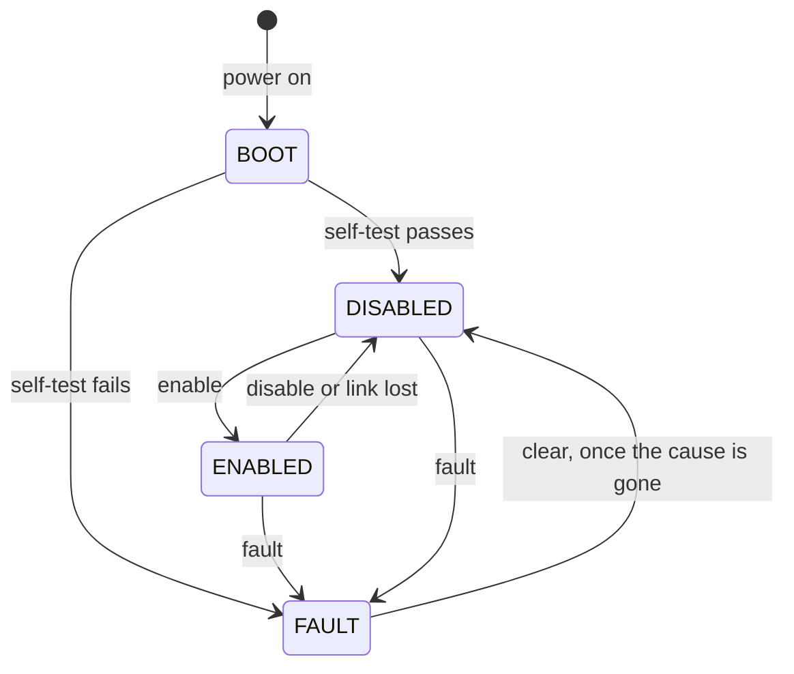
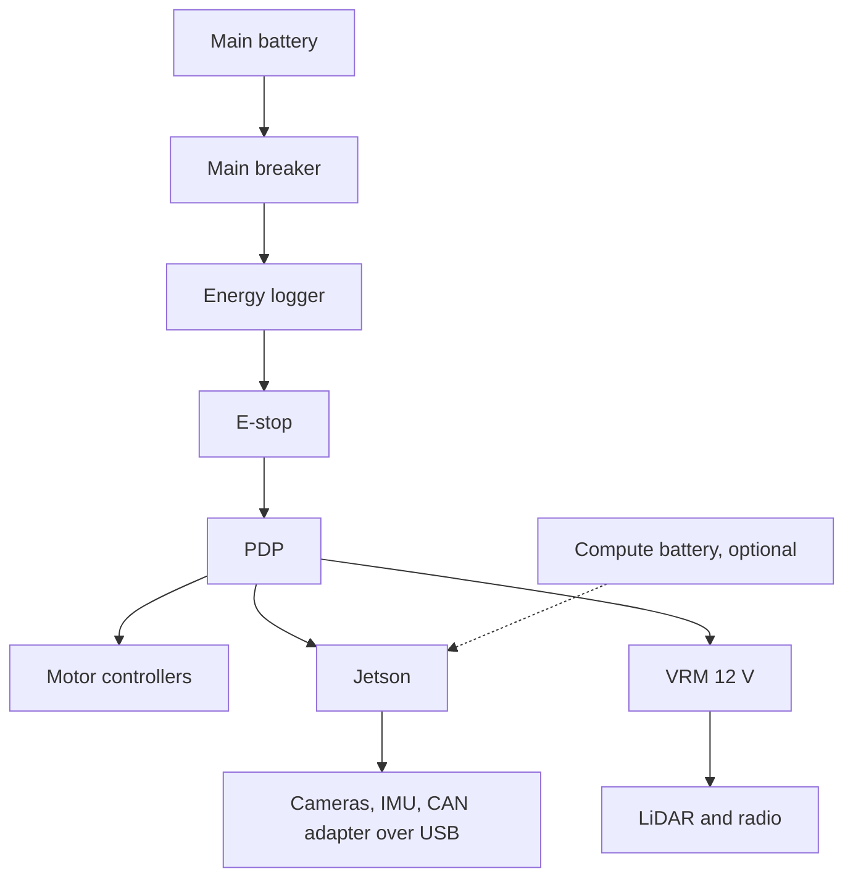
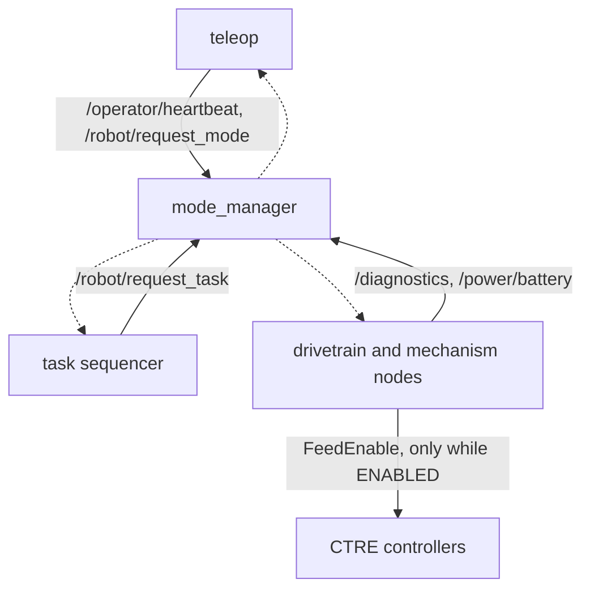

# Operating Modes Design

| Owner | Pair | Status | Last reviewed |
| --- | --- | --- | --- |
| Julian V | Electrical lead (to assign) | Draft | 2026-10-07 |

This doc defines every mode the robot can be in: what has power, what may move, which
software runs, and how the robot moves between modes. Software enforces these modes, and
the power budget computes one load case per mode, so both describe the same robot. The
system design doc's stop behavior (deliverable 1.2) builds on it, and the drivetrain,
mechanism, teleoperation, and autonomy docs follow it.

## 1. Purpose and requirements

Last season's modes existed only as power budget scenarios ("driving", "excavating",
"building"), with no matching software, so neither could check the other. Here a mode is a
contract between three groups:

- **Software** guarantees that only the actuators a mode allows can move, within that
  mode's current limits.
- **Electrical** sizes the battery, breakers, and wires for the worst mode, relying on
  software to enforce it.
- **Operations** (teleop and autonomy) use modes that match the competition's task cycle,
  so each mode is a unit that autonomy can earn points on.

Requirements:

- R1. The robot is always in exactly one mode and publishes it. Every actuator node obeys
  it.
- R2. Nothing moves unless the robot is ENABLED and its task mode allows that actuator.
  The robot is DISABLED after boot and after a fault is cleared, and it never enables
  itself.
- R3. Every actuator output is zero within 100 ms of a disable command, and within
  `link_timeout` plus 100 ms of the last operator heartbeat.
- R4. After a fault or an E-stop, moving again takes two deliberate operator actions:
  clear the fault, then enable. This follows guidebook §13.2.7: "resetting of the E-STOP
  alone shall not resume operation."
- R5. The hardware E-stop meets guidebook §13.2: an unmodified COTS red button at least
  40 mm across, at the highest point, reachable from any side, latching, and with one push
  disconnecting the batteries from all controllers and the other active subsystems. No
  software is in its path.
- R6. The energy logger sits between the battery and the E-stop (guidebook §13.1.2), so
  pressing the E-stop does not erase its reading.
- R7. In every task mode, the current limits of the actuators it allows, plus the
  electronics, add up to less than the main breaker's rating. The power budget relies on
  this.
- R8. While ENABLED, the operator can switch between TELEOP and AUTO without stopping, by
  an explicit command only. Gamepad input is ignored in AUTO, because an autonomous attempt
  must be hands-free (guidebook §16).
- R9. One control on the operator station disables the robot from any mode, to obey the
  power-off command (§13.9.19) and the end-of-run inhibit (§15.4.1).
- R10. What the robot streams to the operator station depends on the mode, to keep average
  bandwidth low: each 1 Mbit/s of average bandwidth costs 30 points per run (§17.1.4).

### The modes

The robot's mode has three layers. Hardware sets the power state; `mode_manager` sets the
robot state and the task mode.

#### Power states (hardware)

| Power state | How it is entered | What has power |
| --- | --- | --- |
| OFF | Main breaker open | Nothing |
| E-STOPPED | E-stop pressed | Only the energy logger, which sits before the E-stop, and a computer on its own battery if the robot has one (§13.2.11, open question 7) |
| POWERED | Main breaker closed and E-stop released | Everything. Motors still move only when software enables them. |

#### Robot states (software)

| Robot state | Meaning | Actuators |
| --- | --- | --- |
| BOOT | Software is starting and running its self-test | Disabled |
| DISABLED | Safe and ready. The robot's resting state: during setup, after a run, and whenever the operator disables it | Disabled |
| ENABLED | Actuators may move, as the task mode allows. Commands come from one control source: TELEOP or AUTO | As the task mode allows |
| FAULT | Something needs a person to look at it. It stays until the operator clears it and its cause is gone | Disabled |

Disabled means the motor controllers have power but get no enable signal, so their output
stays at zero in their configured neutral mode (brake or coast).



An E-stop cuts power, so the robot restarts in BOOT when the E-stop is reset. If the
Jetson stays up on its own battery, `mode_manager` sees every motor controller disappear
and enters FAULT with the reason "main power lost". Either way, the robot cannot move
again until the operator clears and enables it (R4).

#### Task modes (software, only while ENABLED)

The task modes follow the competition cycle in guidebook §3.7.11: excavate, travel loaded,
dump, travel empty. Each is also a unit that autonomy earns points on: excavation
automation, travel automation, and dump automation (§16).

| Task mode | What it is for | Allowed to move |
| --- | --- | --- |
| TRAVEL | Driving between zones, loaded or empty | Drive motors at full limits. The mechanism is stowed and held off. |
| EXCAVATE | Digging regolith into the robot | Excavator chain, depth actuators, and conveyor. Drive at creep speed only (open question 2). |
| DUMP | Depositing regolith on the berm | Hatch, and the conveyor if it unloads (open question 3). Drive at creep speed only. |
| SERVICE | Pit and bench work, such as moving one actuator to check it | Any actuator at reduced limits. TELEOP only. Refused unless the `allow_service` parameter is true, which it never is at competition. |

An enable request names the task mode to start in. After that, any task mode can follow
any other, as long as the new mode's entry guard holds:

| Task mode | Entry guard (proposed; confirm with mechanical) |
| --- | --- |
| TRAVEL | Excavator stowed and hatch closed |
| EXCAVATE | Hatch closed |
| DUMP | Excavator stowed |
| SERVICE | `allow_service` is true and the control source is TELEOP |

When the task mode changes, every actuator the new mode does not allow ramps to zero
straight away, and the new limits apply from the next control cycle. Switching between
TELEOP and AUTO changes neither the task mode nor the limits; the new source's commands
take over and the old source's are ignored.

The guidebook says excavation tools must be "completely removed from contact with the
regolith before returning to remote control operation" (§16.1.5). When the operator takes
control back during EXCAVATE with the excavator lowered, `mode_manager` warns but does not
refuse: the operator must always be able to take control.

### What is on in each mode

This is the electrical contract: which loads can draw current in each mode. The power
budget workbook turns it into amps and watt-hours.

| Load | E-STOPPED | BOOT | DISABLED, FAULT | TRAVEL | EXCAVATE | DUMP |
| --- | --- | --- | --- | --- | --- | --- |
| Drive motors (4 CIM) | No power | Neutral | Neutral | Active | Creep | Creep |
| Excavator chain (775 RedLine) | No power | Neutral | Neutral | Off | Active | Off |
| Depth actuators (2 Glideforce) | No power | Neutral | Neutral | Off, stowed | Active | Off |
| Conveyor (NeveRest) | No power | Neutral | Neutral | Off | Active | Open question 3 |
| Hatch (NeveRest) | No power | Neutral | Neutral | Off, closed | Off, closed | Active |
| Motor controllers, PDP, regulators | No power | Standby | Standby | Standby | Standby | Standby |
| Jetson | Off, unless on its own battery | Booting | On | On | On | On |
| LiDAR, cameras, IMU | No power | On | On | On | On | On |
| Radio | No power | On | On | On | On | On |
| Energy logger | On | On | On | On | On | On |

Neutral and Off draw the same current: zero, plus each controller's small standby draw.
They differ only in why: Neutral because the robot is not enabled, Off because the task
mode does not allow that load.

### Current limits per mode

Each task mode sets supply current limits that the motor controllers enforce. Every limit
must be at or below its PDP channel's breaker, and each mode's total must stay under the
main breaker (R7). These are starting values for the electrical lead to confirm; the
power budget workbook checks them against a 150 A main breaker, where the worst mode,
EXCAVATE, comes to about 135 A.

| Actuator | Controller | TRAVEL | EXCAVATE | DUMP | SERVICE | PDP breaker |
| --- | --- | --- | --- | --- | --- | --- |
| Drive, per motor | Talon SRX leader, Victor SPX follower | 30 A | Creep: 20% output, 15 A | Creep: 20% output, 15 A | 15 A | 40 A |
| Excavator chain | Talon SRX (open question 5) | Off | 30 A | Off | 15 A | 40 A |
| Depth actuators, each | Talon SRX (open question 5) | Off | 15 A | Off | 10 A | 20 A |
| Conveyor | To decide | Off | Full (11.5 A at stall) | Open question 3 | Full | 20 A |
| Hatch | To decide | Off | Off | Full (11.5 A at stall) | Full | 20 A |

"Full" means no software limit is needed, because the motor cannot draw more than its
channel breaker even when stalled at 12 V.

Only a Talon SRX can enforce these limits. A Victor SPX has no current limiting and no
current sensing, so a Victor can only follow a Talon (as the drive followers do, copying
its output) or run a motor whose stall current is already under its breaker, like the
NeveRest motors.

The limits are on supply current, which is what the battery and breakers see. At low speed
a motor carries more current than it draws from the battery: a stalled CIM under a 30 A
supply limit still carries about 70 A, so the drivetrain and mechanism docs need their own
stall detection.

Every controller also runs voltage compensation at 12 V, so a motor behaves the same on a
full battery as on a nearly empty one, and the 12 V motors and actuators never see more
than 12 V on average.

## 2. Nodes

| Node | Package | Runs on | What it does |
| --- | --- | --- | --- |
| `mode_manager` | `luna_modes` (proposed) | Jetson | Owns the robot state and task mode, runs the boot self-test, watches the heartbeat, faults, and battery, and accepts or refuses mode requests |
| Drivetrain node | `luna_drivetrain` | Jetson | Drives only when the mode allows it, within the mode's limits |
| Mechanism node | `luna_mechanism` | Jetson | Runs each mechanism actuator only when the mode allows it, within the mode's limits; reports whether the excavator is stowed and the hatch is closed |
| Teleop | `luna_teleop` | Operator laptop | Sends the heartbeat and mode requests, and gamepad commands while in TELEOP |
| Task sequencer | autonomy (see the autonomy doc) | Jetson | Changes task mode while in AUTO, such as from EXCAVATE to TRAVEL |

### What runs in each mode

| Node | BOOT | DISABLED | ENABLED, TELEOP | ENABLED, AUTO | FAULT |
| --- | --- | --- | --- | --- | --- |
| `mode_manager` | Self-test | Watches heartbeat, faults, battery | Same | Same | Same; waits for a clear |
| Drivetrain node | Output zero; checks its controllers | Output zero; telemetry | Follows `/cmd_vel` within task limits | Same | Output zero |
| Mechanism node | Output zero; checks its controllers | Output zero; telemetry | Follows operator commands within task limits | Follows sequencer commands within task limits | Output zero |
| Teleop (operator laptop) | Heartbeat | Heartbeat; mode requests | Gamepad commands | Heartbeat and mode requests only; gamepad ignored | Heartbeat; clear request |
| Sensor drivers | Starting | Running | Running | Running | Running |
| Localization and mapping | Starting | Running, so AUTO needs no warm-up | Running | Running | Running |
| Planner and task sequencer | Idle | Idle | Idle | Active | Idle |
| Operator stream | Telemetry, low rate | Telemetry, low rate | Camera and telemetry | Obstacle map and planned path; camera off | Telemetry and fault detail |
| Logging (`ros2 bag`) | Starting | Recording | Recording | Recording | Recording |

In AUTO the stream carries the obstacle map and planned path because the judges require
"visualization of the real time obstacle detection and associated mapping of obstacles
and the resulting path planning" (§16), and leaves the camera off to save bandwidth (R10).

## 3. Interfaces

| Name | Kind | Type | Rate | Publisher or server | Subscriber or client | QoS |
| --- | --- | --- | --- | --- | --- | --- |
| `/robot/mode` | topic | `luna_interfaces/msg/RobotMode` | 10 Hz and on change | `mode_manager` | Drivetrain node, mechanism node, teleop, task sequencer | reliable, transient local, depth 1 |
| `/robot/request_mode` | service | `luna_interfaces/srv/RequestMode` | On demand | `mode_manager` | Teleop | default |
| `/robot/request_task` | service | `luna_interfaces/srv/RequestTask` | On demand | `mode_manager` | Task sequencer | default |
| `/operator/heartbeat` | topic | `std_msgs/msg/Header` | 10 Hz | Teleop | `mode_manager` | best effort, depth 1 |
| `/diagnostics` | topic | `diagnostic_msgs/msg/DiagnosticArray` | 1 Hz and on change | Drivetrain node, mechanism node, sensor drivers, task sequencer | `mode_manager` | reliable, depth 10 |
| `/power/battery` | topic | `sensor_msgs/msg/BatteryState` | 10 Hz | The node that owns CTRE access (open question 6) | `mode_manager`, teleop | best effort, depth 1 |
| `/mechanism/status` | topic | Defined in the mechanism doc | Defined in the mechanism doc | Mechanism node | `mode_manager` | Defined in the mechanism doc |

`mode_manager` refuses `/robot/request_task` unless the robot is ENABLED in AUTO, so the
sequencer can change task mode but can never enable the robot or take control. To stop
the robot, for example when it loses its position, the sequencer reports an ERROR on
`/diagnostics`, which puts the robot in FAULT.

Proposed `luna_interfaces/msg/RobotMode`:

```text
uint8 STATE_BOOT=0
uint8 STATE_DISABLED=1
uint8 STATE_ENABLED=2
uint8 STATE_FAULT=3

uint8 SOURCE_NONE=0
uint8 SOURCE_TELEOP=1
uint8 SOURCE_AUTO=2

uint8 TASK_NONE=0
uint8 TASK_TRAVEL=1
uint8 TASK_EXCAVATE=2
uint8 TASK_DUMP=3
uint8 TASK_SERVICE=4

uint8 state
uint8 source                    # SOURCE_NONE unless ENABLED
uint8 task                      # TASK_NONE unless ENABLED
string reason                   # why the robot is in this state, such as "link lost"
builtin_interfaces/Time since   # when the robot entered this state
```

Proposed `luna_interfaces/srv/RequestMode`, for the operator:

```text
uint8 state    # RobotMode STATE_ENABLED or STATE_DISABLED; DISABLED while in FAULT clears the fault
uint8 source   # for ENABLED: SOURCE_TELEOP or SOURCE_AUTO
uint8 task     # for ENABLED: the task mode to run
---
bool accepted
string reason  # why a request was refused, such as "excavator not stowed"
```

Proposed `luna_interfaces/srv/RequestTask`, for the task sequencer:

```text
uint8 task     # RobotMode TASK_TRAVEL, TASK_EXCAVATE, or TASK_DUMP
---
bool accepted
string reason
```

## 4. Parameters

| Parameter | Node | Type | Default | Units | Meaning |
| --- | --- | --- | --- | --- | --- |
| `link_timeout` | `mode_manager` | double | 0.5 | s | Heartbeat age that counts as link lost (open question 9) |
| `mode_timeout` | Drivetrain and mechanism nodes | double | 0.3 | s | If the last `/robot/mode` is older than this, act as DISABLED |
| `allow_service` | `mode_manager` | bool | false | | Allow the SERVICE task mode. False at competition. |
| `selftest_timeout` | `mode_manager` | double | 60.0 | s | Time BOOT waits for every check before entering FAULT |
| `expected_can_devices` | `mode_manager` | string array | | | The controllers and PDP the self-test requires |
| `creep_output` | Drivetrain node | double | 0.2 | fraction | Largest drive output in EXCAVATE and DUMP |
| `current_limit.<actuator>.<task>` | Drivetrain and mechanism nodes | double | See [Current limits per mode](#current-limits-per-mode) | A | Supply current limit for each actuator in each task mode |
| `voltage_compensation` | Drivetrain and mechanism nodes | double | 12.0 | V | Controllers scale their output to this voltage |
| `battery_cells` | `mode_manager` | int | 4 | | Cells in series in the main battery |
| `cell_warn_v` | `mode_manager` | double | 3.5 | V | Below this per cell, warn the operator (4S LiPo value) |
| `cell_critical_v` | `mode_manager` | double | 3.3 | V | Below this per cell for `low_voltage_hold`, halve every current limit (4S LiPo value) |
| `low_voltage_hold` | `mode_manager` | double | 2.0 | s | How long the voltage must stay low, so brief sag under load is ignored |

The battery thresholds are for LiPo cells and change if the battery does (open question 1).

## 5. Libraries and hardware interfaces

- **Phoenix 5 enable.** The motor controllers run only while some process calls
  `ctre::phoenix::unmanaged::Unmanaged::FeedEnable()`. The enable frame (`000401BF` in
  `candump`, see [CAN bus](../can-bus.md)) carries no device number, so it looks like it
  enables every CTRE controller on the bus, whichever process sends it. Exactly one
  process may feed it, and only while ENABLED (open question 6).
- **PDP over CAN.** The PDP reports battery voltage, the current on each channel, and the
  energy used, which feed `/power/battery`. Logging them by mode checks the power budget
  against real runs, and shows the energy score before the judges' logger does.
- **Controller settings.** Each node sets its controllers' current limits, voltage
  compensation, and neutral mode from parameters at startup: brake for the drive motors
  and hatch, so they hold still when disabled, and coast for the excavator chain.
- **E-stop, main breaker, and energy logger.** Hardware only, with no software interface.
  The power path, with the Jetson fed straight from the battery (its carrier takes 9 to
  20 V):



## 6. Block diagram



The dotted arrows are `/robot/mode`, which every node follows.

## 7. Behavior on failure

| Failure | How it is detected | What happens |
| --- | --- | --- |
| Operator link lost | No heartbeat for `link_timeout` | ENABLED becomes DISABLED with the reason "link lost". The operator enables again once the link is back. This applies in AUTO too, because while the link is down the robot cannot hear the power-off command (§13.9.19). |
| `mode_manager` stops | `/robot/mode` older than `mode_timeout` | Each actuator node sets its outputs to zero and the enable stops being fed |
| The node feeding the enable stops | The Phoenix enable times out | Controllers disable themselves within 100 ms |
| Drive commands stop | `/cmd_vel` older than the drivetrain's timeout (drivetrain doc) | Drive output zero; mode unchanged |
| A controller or the PDP is missing or faulted | Missing CAN status, or an ERROR on `/diagnostics` | FAULT |
| E-stop pressed | Hardware cuts power | Everything stops. After the reset, the robot boots, or enters FAULT if the Jetson stayed up; the operator clears and enables. |
| Battery low | `/power/battery` below `cell_critical_v` per cell for `low_voltage_hold` | Every current limit halves and the operator is warned. The robot keeps running. |
| Jetson browns out | The Jetson resets | The enable stops, so controllers disable within 100 ms; the robot boots to DISABLED. Current limits prevent this by keeping the battery above the Jetson's and VRM's minimum inputs. |
| A mode request breaks a guard | `mode_manager` checks guards | Refused with a reason; the mode does not change |
| A guard sensor fails | Mechanism status missing or implausible | Modes guarded by it are refused. The team uses SERVICE in the pits to fix it. |

## 8. Test plan

| Requirement | Test | Where | Result |
| --- | --- | --- | --- |
| R1 | Launch test: step through every state and task mode on fake data, and check `/robot/mode` and each node's output | Laptop | Not run |
| R2 | After boot, send drive and mechanism commands: nothing moves. Clear a fault: the robot stays DISABLED. | Bench | Not run |
| R3 | Disable mid-drive, and separately unplug the operator Wi-Fi mid-drive, with the wheels off the ground. Measure the time to zero output in the bag. | Bench | Not run |
| R4 | Press and reset the E-stop while ENABLED; nothing moves until clear and enable | Robot | Not run |
| R5 | Inspection checklist (§12.1); with the E-stop pressed, measure every rail at zero except the logger and any compute battery | Robot | Not run |
| R6 | Read the logger, press and reset the E-stop, read it again: unchanged | Robot | Not run |
| R7 | The budget workbook's Protection sheet passes for every mode, and each limit read back from its controller matches the parameter | Bench | Not run |
| R8 | Switch TELEOP to AUTO and back while driving on fake planner output; gamepad input in AUTO has no effect | Laptop | Not run |
| R9 | Disable from every state and task mode | Bench | Not run |
| R10 | Measure average bandwidth in each mode with `ros2 topic bw` | Bench | Not run |

## 9. Open questions

| Question | Owner | Due |
| --- | --- | --- |
| 1. Keep the 4S LiPo (16.8 V full) or move to a 12 V class battery? The Victor SPX, PDP, and VRM are rated to 16 V (see the power budget audit). | Electrical lead | 2026-10-25 |
| 2. Does the robot drive while digging? A comment on the Spring 2026 power budget (cell M3) asks the same. If not, EXCAVATE allows no drive. | Mechanical lead | 2026-10-25 |
| 3. Does the conveyor run during DUMP? | Mechanical lead | 2026-10-25 |
| 4. Which sensors tell software that the excavator is stowed and the hatch is closed? The entry guards need them. | Mechanical and electrical leads | 2026-11-01 |
| 5. Which controller runs each mechanism motor? Motors that need a current limit must be on a Talon SRX: the excavator's 775 RedLine (130 A stall) and the depth actuators (about 50 A stall). | Electrical lead | 2026-11-01 |
| 6. Does one process's Phoenix enable keep another process's controllers enabled? This decides which node feeds the enable and owns CTRE access. Test on the bench. | Drivetrain owner | 2026-10-25 |
| 7. Give the Jetson its own battery (§13.2.11), so an E-stop does not reboot it or cut its logs? | Electrical lead and software lead | 2026-11-01 |
| 8. Ask the organizers: does energy used during the 10-minute setup count, and does a separate compute battery have to go through the energy logger? | Software lead | 2026-10-25 |
| 9. Should `link_timeout` be longer in AUTO, to ride through Wi-Fi dropouts? Measure dropouts in the pits first. | Teleop owner | 2026-11-08 |
| 10. Does anything deploy after the run starts (stowed envelope 150 × 75 × 75 cm, §13.3)? If so, add a DEPLOY step. | Mechanical lead | 2026-11-01 |

## Handoff

Not yet written: this doc is a draft.
