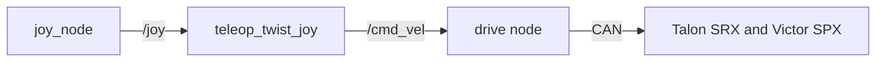

# [Subsystem] design

| Owner | Pair | Status | Last reviewed |
| --- | --- | --- | --- |
| [name] | [name] | Draft | YYYY-MM-DD |

Status is `Draft` (being written), `Current` (matches the code), or `Superseded` (replaced;
link the replacement).

To start a new doc, copy this file to `docs/design/<subsystem>.md`, fill in every section,
and delete this paragraph. Write "None" rather than deleting a section.
[Design docs](README.md) explains how design docs work.

## 1. Purpose and requirements

What this subsystem does for the robot, and what it must achieve. Number the requirements
so tests and reviews can refer to them.

- R1.
- R2.

## 2. Nodes

| Node | Package | Runs on | What it does |
| --- | --- | --- | --- |
| | | Jetson / operator laptop | |

## 3. Interfaces

This table is the contract between this subsystem and the rest of the robot. The code must
match it exactly, and a pull request that changes an interface updates this table in the
same pull request.

| Name | Kind | Type | Rate | Publisher or server | Subscriber or client | QoS |
| --- | --- | --- | --- | --- | --- | --- |
| `/example_topic` (example row, replace it) | topic | `geometry_msgs/msg/Twist` | 20 Hz | `example_publisher` | `example_subscriber` | reliable, depth 10 |

Kind is topic, service, or action. Use standard message types where they fit; custom types
go in `luna_interfaces`.

## 4. Parameters

| Parameter | Node | Type | Default | Units | Meaning |
| --- | --- | --- | --- | --- | --- |
| | | | | | |

## 5. Libraries and hardware interfaces

Libraries and drivers this subsystem uses, and the hardware it talks to: buses, CAN IDs,
USB devices, serial ports, and wiring.

## 6. Block diagram

Draw the diagram in [Mermaid](https://mermaid.js.org/syntax/flowchart.html), which GitHub
renders and which diffs like code. Example:

## 7. Behavior on failure

What happens when inputs stop, hardware faults, or the operator link drops. Every actuator
must stop on its own.

| Failure | How it is detected | What the subsystem does |
| --- | --- | --- |
| | | |

## 8. Test plan

How each requirement is verified: unit tests, bench tests, and tests on the robot. Link
logs and recordings.

| Requirement | Test | Where | Result |
| --- | --- | --- | --- |
| R1 | | bench / robot | |

## 9. Open questions

| Question | Owner | Due |
| --- | --- | --- |
| | | |

## Handoff

Filled in at the end of each semester: five lines on what works, what does not, and what
comes next.
