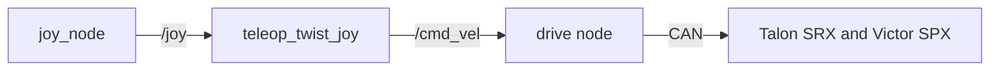

# [Subsystem] Subsystem Design

> **Delete this block after copying.** How to use this template:
>
> 1. Copy this file to `docs/design/<subsystem>.md`, using the file name listed in
>    [Design docs](README.md#the-docs).
> 2. Replace every `[bracketed]` placeholder, including `[Subsystem]` in the title above
>    (for example, "Drivetrain Subsystem Design").
> 3. Fill in every section. Write "None" rather than deleting a section, so readers know
>    it was considered.
> 4. Delete every quote block that starts with **Delete this**, like this one. Everything
>    else stays.
>
> Status is one of `Draft` (being written), `Approved` (reviewed, no code yet),
> `In progress` (code being written to match), `Current` (code matches), or `Superseded`
> (replaced; link the replacement). [Design docs](README.md#status) explains each one.

| Owner | Pair | Status | Last reviewed |
| --- | --- | --- | --- |
| [name] | [name] | Draft | [YYYY-MM-DD] |

## 1. Purpose and requirements

> **Delete this:** say what this subsystem does for the robot and what it must achieve.
> Number the requirements so tests and reviews can refer to them.

- R1. [requirement]
- R2. [requirement]

## 2. Nodes

| Node | Package | Runs on | What it does |
| --- | --- | --- | --- |
| [node] | [package] | [Jetson or operator laptop] | [what it does] |

## 3. Interfaces

This table is the contract between this subsystem and the rest of the robot. The code must
match it exactly, and a pull request that changes an interface updates this table in the
same pull request.

> **Delete this:** list every topic, service, and action. Kind is topic, service, or
> action. Use standard message types where they fit; custom types go in
> `luna_interfaces`. The row below is an example; replace it.

| Name | Kind | Type | Rate | Publisher or server | Subscriber or client | QoS |
| --- | --- | --- | --- | --- | --- | --- |
| `/example_topic` | topic | `geometry_msgs/msg/Twist` | 20 Hz | `example_publisher` | `example_subscriber` | reliable, depth 10 |

## 4. Parameters

| Parameter | Node | Type | Default | Units | Meaning |
| --- | --- | --- | --- | --- | --- |
| [parameter] | [node] | [type] | [default] | [units] | [meaning] |

## 5. Libraries and hardware interfaces

> **Delete this:** list the libraries and drivers this subsystem uses, and the hardware it
> talks to: buses, CAN IDs, USB devices, serial ports, and wiring.

## 6. Block diagram

> **Delete this:** draw the diagram in
> [Mermaid](https://mermaid.js.org/syntax/flowchart.html), which GitHub and the docs
> website render, and which diffs like code. The diagram below is an example; replace it.

## 7. Behavior on failure

> **Delete this:** say what happens when inputs stop, hardware faults, or the operator
> link drops. Every actuator must stop on its own.

| Failure | How it is detected | What the subsystem does |
| --- | --- | --- |
| [failure] | [detection] | [response] |

## 8. Test plan

> **Delete this:** say how each requirement is verified: unit tests, bench tests, and
> tests on the robot. Link logs and recordings.

| Requirement | Test | Where | Result |
| --- | --- | --- | --- |
| R1 | [test] | [bench or robot] | [result] |

## 9. Open questions

| Question | Owner | Due |
| --- | --- | --- |
| [question] | [name] | [YYYY-MM-DD] |

## Handoff

> **Delete this:** fill in at the end of each semester: five lines on what works, what
> does not, and what comes next.
