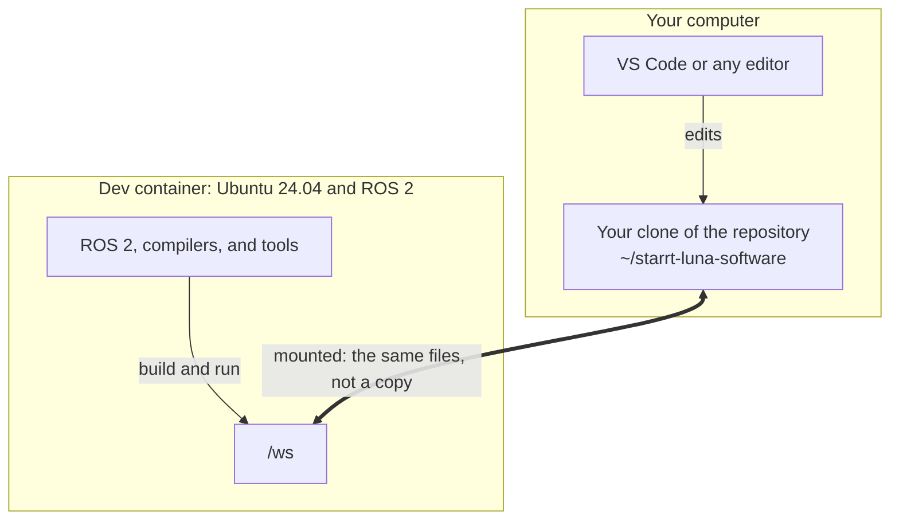

# Containers and the dev container

The robot's code needs Linux, ROS 2, and a long list of tools at exactly the right
versions. Installing all of that by hand on every member's laptop would take days, and
would break in a different way on each one. Instead, the team packages the whole setup
with Docker. This page explains what Docker does, what our dev container is, and how the
files on your computer show up inside it.

## Containers: a computer inside your computer

**Docker** runs **containers**. A container is like a lightweight, separate computer
running inside yours. It has its own operating system files and its own installed
programs, and it is kept apart from the rest of your computer: installing something inside
a container does not change your computer, and the container cannot see your files unless
you let it.

Containers are made from **images**. Think of an image as a blueprint and a container as
a house built from it:

- The **image** is a frozen, ready-made setup: an operating system with everything
  already installed. It never changes once it is built.
- A **container** is a running copy made from an image. You can build many containers from
  one image, and moving furniture around in one house does not change the blueprint.
- A **Dockerfile** is the written recipe for building an image, step by step. Ours is
  `.devcontainer/Dockerfile`.

On Windows and macOS, Docker Desktop quietly runs a small Linux virtual machine in the
background, because containers need Linux underneath. You do not have to manage it.

### Try it: your first container

With Docker installed and running (see [Getting started](../getting-started.md)), run:

```bash
docker run hello-world
```

The first time, Docker downloads the `hello-world` image, so you see a few download lines,
then:

```text
Hello from Docker!
This message shows that your installation appears to be working correctly.
```

In those few seconds, Docker downloaded an image, built a container from it, ran the
program inside, and the container stopped when the program finished.

## The dev container

A **dev container** is a container set up for writing code. Ours is built from an image
with Ubuntu 24.04, ROS 2 Jazzy, compilers, and every tool the robot code needs. The file
`.devcontainer/devcontainer.json` tells VS Code (or `scripts/dev`) how to build and start
it.

When VS Code opens the repository "in the container", it starts the dev container and
connects to it. From then on, the terminals you open in VS Code run inside the container,
where ROS 2 is installed, even if your computer runs Windows or macOS.

## Mounting: how your files get into the container

A container normally sees only its own files. **Mounting** connects a folder from your
computer into the container, so the container can see it too. The dev container mounts
your clone of the repository at the path `/ws` inside the container.

The key idea: **mounting does not copy anything.** There is only one set of files, on your
computer, and the container looks at that same folder through `/ws`. It is like two rooms
with a window between them, looking at the same table: whatever you put on the table from
one room is right there when you look from the other.



So:

- When you save a file in VS Code, the container sees the change instantly. There is
  nothing to sync or upload.
- When something inside the container creates a file in `/ws`, such as a build, it appears
  in your clone on your computer.
- Your code is safe if the container is deleted or rebuilt, because it was never stored in
  the container in the first place.

### What lives where

| What | Where it really lives | Kept when the container is rebuilt? |
| --- | --- | --- |
| Your code, and everything else in the repository | Your computer, seen in the container at `/ws` | Yes |
| Build output: `build/`, `install/`, `log/` | Your computer, inside your clone | Yes |
| ROS 2, compilers, and tools | The container image | Rebuilt from `.devcontainer/Dockerfile` |
| Files anywhere else in the container, such as its home folder `/home/ubuntu` | The container | No |

The last row matters: anything you save inside the container outside `/ws` disappears when
the container is rebuilt. Keep your work in the repository.

### Try it: see the mount for yourself

Do this once your dev container is running ([Getting started](../getting-started.md)
step 3). In a VS Code terminal, which runs inside the container, create a file in `/ws`:

```bash
echo "Hello from inside the container" > /ws/hello.txt
```

Now look at your clone from outside the container: the file `hello.txt` is there, in VS
Code's file list and in your computer's own file browser. Open it in VS Code, add a line,
and save. Back in the container terminal:

```bash
cat /ws/hello.txt
```

```text
Hello from inside the container
Hello back from outside
```

(The second line is whatever you added.) One file, seen from two places. Delete it when
you are done, from either side:

```bash
rm /ws/hello.txt
```

## Inside or outside? How to tell

Because the container has its own operating system, it matters which terminal you type in.
A terminal inside the dev container has a prompt like this, ending in `/ws`:

```text
ubuntu@laptop:/ws$
```

Inside, you are the user `ubuntu` and start in `/ws`. Your computer's own terminal shows
your own username and home folder instead. ROS 2 commands such as `ros2` and `colcon` only
work inside (unless you installed ROS 2 on your computer yourself).

## Two more ideas you will meet

- **Ports and `localhost`.** Programs that talk over a network listen on a numbered
  **port**, like an apartment number in a building. `localhost` means "this computer". The
  dev container's desktop for programs with windows listens on port 6080, so you open it
  at `http://localhost:6080`. See [GUI tools](../gui-tools.md).
- **Rebuilding.** When the dev container's setup in `.devcontainer/` changes, the image has
  to be built again, which VS Code calls **Rebuild Container**. Your code is untouched,
  because it lives on your computer.

## Key ideas

- An image is a frozen setup; a container is a running copy of it; a Dockerfile is the
  recipe for the image.
- The dev container gives every computer the same Linux and ROS 2 setup.
- Mounting shares your clone with the container at `/ws`. It is the same files, not a
  copy, so edits on either side are instantly visible on the other.
- Only `/ws` is shared. Anything saved elsewhere in the container is lost when it is
  rebuilt.

Next: [Getting started](../getting-started.md), to set up your own dev container.
