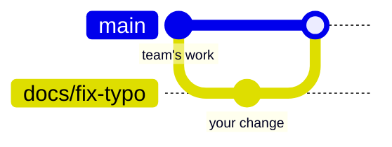
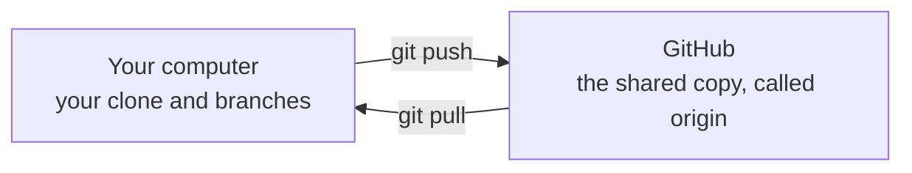

# Git and GitHub

Many people work on the robot's code at the same time. **Git** keeps track of every change
anyone makes, and **GitHub** is the website that stores the team's shared copy and where
changes get reviewed. This page explains the ideas, sets Git up on your computer, and walks
through the commands you will use every week.

## Why we use Git

Think of the version history in Google Docs, but for a whole folder of code. Git records
who changed what, when, and why. You can see any earlier version, undo a mistake, and work
on your own change without disturbing anyone else's. Nothing reaches the robot until
someone else has reviewed it.

## The main ideas

- A **repository** (or **repo**) is a project folder that Git tracks, along with its full
  history. Ours is called `starrt-luna-software`.
- A **commit** is a saved snapshot of changes, with a short message saying what changed
  and why. The history of a repository is a chain of commits.
- A **branch** is a separate line of work. `main` is the team's official version, the one
  that runs on the robot. You make each change on your own branch, so `main` keeps working
  while you experiment.
- **Cloning** makes your own full copy of a repository on your computer.
- **Pushing** sends your commits from your computer to GitHub. **Pulling** brings other
  people's commits from GitHub to your computer.
- A **pull request** (PR) asks for your branch to be added to `main`. Teammates review it,
  and once it is approved, it is **merged**: its commits become part of `main`.

Here is the life of one change. You branch off `main`, commit on your branch, and your
work is merged back after review:



Your computer and GitHub each hold a copy of the repository. Git calls the GitHub copy
`origin`:



## Set up Git (once)

1. **Check that Git is installed** by running `git --version`. It prints something like
   `git version 2.43.0`. If it is missing, macOS offers to install it for you, and on
   Ubuntu or WSL you install it with `sudo apt install git`.
2. **Tell Git who you are.** Every commit records a name and email. Use the email of your
   GitHub account:

   ```bash
   git config --global user.name "Ada Lovelace"
   git config --global user.email "ada@example.com"
   ```

3. **Make a GitHub account** at [github.com](https://github.com/) if you do not have one,
   and accept the invitation to the `STAR-Robotics-Team` organization, so you can push to
   the team's repository.
4. **Sign in from the command line,** so Git can push for you. The simplest way is the
   [GitHub CLI](https://cli.github.com/): install it (`sudo apt install gh` on Ubuntu or
   WSL; on macOS, follow the instructions on its website), then run:

   ```bash
   gh auth login
   ```

   Choose **GitHub.com**, then **HTTPS**, say yes when it asks to authenticate Git with
   your GitHub credentials, and choose **Login with a web browser**. With that done, clone
   repositories with their `https://` address. VS Code shares this sign-in with the dev
   container, so pushing works from there too.

## The commands you will use

This section follows one small change from start to finish. You can run the commands as
you read, in a clone of our repository; the changes stay on your computer until you push.
The messages shown are what Git really prints; the file names and contents in them will be
whatever you changed.

### Get a copy: `git clone`

```bash
git clone https://github.com/STAR-Robotics-Team/starrt-luna-software.git
cd starrt-luna-software
```

```text
Cloning into 'starrt-luna-software'...
```

Git prints a few more lines while it downloads the whole repository, history included,
into a new folder named after it.

### See where you stand: `git status`

`git status` is the command to run whenever you are unsure what is going on:

```text
On branch main
Your branch is up to date with 'origin/main'.

nothing to commit, working tree clean
```

You are on `main`, your copy matches GitHub's, and you have not changed anything.

### Start a branch: `git switch -c`

Never work directly on `main`. Make a branch, named after your workstream and what you are
doing:

```bash
git switch -c docs/fix-typo
```

```text
Switched to a new branch 'docs/fix-typo'
```

### Change something, then look at it: `git diff`

Edit a file in your editor and save it. Now `git status` lists the file as modified:

```text
On branch docs/fix-typo
Changes not staged for commit:
  (use "git add <file>..." to update what will be committed)
  (use "git restore <file>..." to discard changes in working directory)
	modified:   README.md
```

`git diff` shows exactly what changed. Lines starting with `+` were added, and lines
starting with `-` were removed. For example, adding a line to a file shows:

```text
@@ -1 +1,2 @@
 # Demo
+More text.
```

### Save a snapshot: `git add` and `git commit`

Committing takes two steps. `git add` picks which changes go into the next snapshot (this
is called **staging**), and `git commit` saves the snapshot with a message:

```bash
git add README.md
git commit -m "Fix a typo in the README"
```

```text
[docs/fix-typo c9717af] Fix a typo in the README
 1 file changed, 1 insertion(+)
```

`c9717af` is the start of the commit's ID, a unique label Git gives every commit. Write
messages that finish the sentence "This commit will...": "Fix a typo in the README", not
"stuff" or "changes".

### Share it: `git push`

```bash
git push -u origin docs/fix-typo
```

This sends your branch to GitHub. The first time you push a branch, `-u origin` tells Git
where it lives, so later pushes on that branch only need `git push`. GitHub then prints a
link to open a pull request; [Your first pull request](first-pull-request.md) takes it
from there.

### See the history: `git log`

```bash
git log --oneline
```

```text
c9717af Fix a typo in the README
2edd17f First commit
```

### Catch up with the team: `git pull`

Other people's work reaches `main` all the time. Before you start something new, switch
to `main` and pull:

```bash
git switch main
git pull
```

```text
Switched to branch 'main'
Your branch is up to date with 'origin/main'.
Already up to date.
```

## Where to run Git commands

Run them in your computer's own terminal or in a dev container terminal. Both work on the
same files, because the container shares your clone (see
[Containers and the dev container](containers.md)). VS Code also has a **Source Control**
panel that runs the same Git commands with buttons, if you prefer clicking; it is worth
knowing the commands first, so you understand what the buttons do.

## Good habits

- **Pull `main` before you start,** and make a new branch for each task.
- **Commit small and often,** with messages that say what changed.
- **Run `git status`** whenever you are unsure.
- **Never push to `main` directly.** Everything goes through a pull request.
- **Never commit passwords, keys, or build output.** The repository's `.gitignore` file
  already tells Git to ignore build output.

## Key ideas

- A repository is a tracked project; a commit is a snapshot; a branch is a separate line
  of work, and `main` is the official one.
- Clone once, then branch, edit, add, commit, and push.
- A pull request asks for review; once approved, the branch is merged into `main`.
- `git status` tells you where you stand.

Next: [Containers and the dev container](containers.md).
