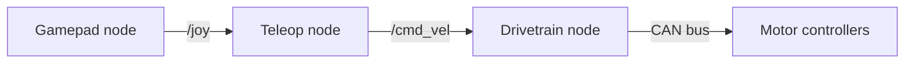
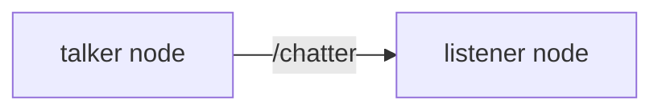

# ROS 2 basics

ROS 2 (Robot Operating System 2) is the framework the rover's software is built on.
Despite the name, it is not an operating system: it is a set of libraries and tools that
let a robot's programs talk to each other. On this page you will watch ROS 2 programs
exchange messages, drive a simulated turtle with a command, and learn how ROS code is
organized and built.

You need a running dev container for the exercises; see
[Getting started](../getting-started.md). Run every command in a VS Code terminal inside
the container.

## Why ROS

A robot does many things at once: it reads sensors, drives motors, listens to the
operator, and checks that everything is safe. ROS lets each job be a small, separate
program, and connects them with messages. It works like a group chat with channels: each
program posts updates to the channels it is responsible for and listens to the channels it
cares about. Programs do not need to know about each other, only about the channels.

## Nodes, topics, and messages

- A **node** is one program in the robot's system, such as the node that drives the
  motors.
- A **topic** is a named channel that nodes send messages on, such as `/cmd_vel`, which
  carries driving commands. Topic names start with `/`.
- A **message** is one piece of data sent on a topic. Every topic has a **message type**
  that fixes what a message contains, so every node agrees on the format.
- A node that sends messages on a topic **publishes** to it; a node that receives them
  **subscribes** to it. A topic can have many publishers and subscribers.

This is how the rover will be driven:



The gamepad node publishes button presses on `/joy`. The teleop node turns them into
driving commands on `/cmd_vel`, and the drivetrain node subscribes to `/cmd_vel` and turns
each command into motor outputs.

## Try it: watch two nodes talk

ROS comes with two demo nodes: a **talker** that publishes a message every second on the
topic `/chatter`, and a **listener** that subscribes to it.



Open three terminals in VS Code. You can split the terminal panel with the split icon, so
you can see them side by side.

1. In the first terminal, start the talker:

    ```bash
    ros2 run demo_nodes_cpp talker
    ```

    It prints `Publishing: 'Hello World: 1'`, then 2, 3, and so on.

2. In the second terminal, start the listener:

    ```bash
    ros2 run demo_nodes_cpp listener
    ```

    It prints `I heard: [Hello World: 5]`, picking up from whatever number the talker has
    reached.

3. In the third terminal, look around. Ask which nodes are running:

    ```bash
    ros2 node list
    ```

    ```text
    /listener
    /talker
    ```

    Which topics exist:

    ```bash
    ros2 topic list
    ```

    ```text
    /chatter
    /parameter_events
    /rosout
    ```

    `/chatter` is the demo's topic. ROS creates the other two itself for settings and log
    messages.

    If a list looks empty or incomplete, wait a second and run the command again. The first
    `ros2` command you run starts a helper in the background, and it takes a moment to find
    everything.

4. Ask about the `/chatter` topic:

    ```bash
    ros2 topic info /chatter
    ```

    ```text
    Type: std_msgs/msg/String
    Publisher count: 1
    Subscription count: 1
    ```

    One node publishes (the talker), one subscribes (the listener), and messages are of
    type `std_msgs/msg/String`.

5. See what that message type contains:

    ```bash
    ros2 interface show std_msgs/msg/String
    ```

    After a few comment lines starting with `#`, it ends with:

    ```text
    string data
    ```

    A `String` message has a single field, called `data`, that holds text.

6. Listen in on the topic yourself:

    ```bash
    ros2 topic echo /chatter
    ```

    ```text
    data: 'Hello World: 10'
    ---
    data: 'Hello World: 11'
    ---
    ```

    Press Ctrl+C to stop.

7. Publish your own message from the command line:

    ```bash
    ros2 topic pub --once /chatter std_msgs/msg/String "{data: hi from the command line}"
    ```

    Look at the listener's terminal: among the talker's messages, it printed
    `I heard: [hi from the command line]`. The listener does not know or care who sent it;
    it only listens to the topic.

Stop the talker and listener with Ctrl+C in their terminals.

## Try it: drive a turtle

turtlesim is a tiny simulated robot that ROS uses for teaching. Open the VNC desktop in
your browser at <http://localhost:6080/vnc.html?autoconnect=true&resize=remote> (see
[GUI tools](../gui-tools.md)), then start turtlesim in a terminal:

```bash
ros2 run turtlesim turtlesim_node
```

A window with a turtle appears on the desktop. In a second terminal, see its topics:

```bash
ros2 topic list
```

```text
/parameter_events
/rosout
/turtle1/cmd_vel
/turtle1/color_sensor
/turtle1/pose
```

The turtle listens for driving commands on `/turtle1/cmd_vel`. Check its type:

```bash
ros2 topic info /turtle1/cmd_vel
```

```text
Type: geometry_msgs/msg/Twist
Publisher count: 0
Subscription count: 1
```

`geometry_msgs/msg/Twist` is the standard ROS message for "move at this speed": a
`linear` velocity (forward and back) and an `angular` velocity (turning). It is exactly the
message our rover's drivetrain will listen to on `/cmd_vel`. Send the turtle one:

```bash
ros2 topic pub --once /turtle1/cmd_vel geometry_msgs/msg/Twist "{linear: {x: 2.0}, angular: {z: 1.8}}"
```

The turtle drives forward while turning, drawing a curve. Change the numbers and send it
again. To drive it with your keyboard instead, run this in a terminal and use the arrow
keys while that terminal is selected:

```bash
ros2 run turtlesim turtle_teleop_key
```

To see the whole system as a picture, run `rqt_graph` in another terminal while the
keyboard teleop is running. It draws each node as an oval and each topic as an arrow
between them: `/teleop_turtle` sends `/turtle1/cmd_vel` to `/turtlesim` (plus two arrows
for turtlesim's rotate feature). If the window is empty, press its refresh button, the
circular arrows in the top-left corner.

Stop everything with Ctrl+C when you are done.

## Packages and the workspace

ROS code is organized into **packages**. A package is a folder of code that is built as
one unit, with a `package.xml` file listing its name and what it depends on. Our packages
live in the repository's `src/` folder, such as `src/luna_drivetrain`.

The repository is a ROS **workspace**: a folder with a `src/` folder of packages. Building
the workspace creates three more folders next to `src/`:

| Folder | What is in it |
| --- | --- |
| `src/` | The source code you write. This is the only one stored in Git. |
| `build/` | Temporary files from building. |
| `install/` | The finished programs and files, ready to run. |
| `log/` | Records of each build, useful when something fails. |

**colcon** is the tool that builds every package in the workspace:

```bash
colcon build
```

C++ code has to be **compiled** (translated into a program the computer can run) before
it can run, so after you change C++ code, you build again. A package provides
**executables** (programs you can run), which you start with
`ros2 run <package> <executable>`, as you did with `ros2 run demo_nodes_cpp talker`.

## Sourcing: why you sometimes open a new terminal

How does `ros2 run` know where to find a package's programs? Through environment
variables (see [The command line](command-line.md#environment-variables)), which are set
by **sourcing** a setup file:

- `source /opt/ros/jazzy/setup.bash` tells the terminal about ROS 2 itself.
- `source install/setup.bash` tells it about the packages in our workspace.

The dev container does both for you every time you open a terminal, the second one as
soon as the workspace has been built. But a terminal only reads them when it opens, so a
terminal opened before a build does not know about packages that build just added. That
is why the docs say to open a new terminal after building, or to run
`source install/setup.bash` yourself.

## Two more ideas you will meet

- A **launch file** starts several nodes at once, with their settings, so you do not need
  a terminal for each one.
- A **parameter** is a setting a node reads when it starts, such as a motor's CAN ID or a
  maximum speed. Each subsystem's design doc lists its parameters.

## Key ideas

- Nodes are programs; topics are named channels; messages have fixed types.
- Nodes publish to and subscribe to topics, without needing to know about each other.
- `ros2 node list`, `ros2 topic list`, `ros2 topic info`, and `ros2 topic echo` let you
  look inside a running system.
- Code lives in packages under `src/`; `colcon build` builds them into `install/`.
- Sourcing a setup file tells a terminal where ROS and our packages are.

To go deeper, the official [ROS 2 Jazzy tutorials](https://docs.ros.org/en/jazzy/Tutorials.html)
cover each of these ideas with more exercises.

Next: [Your first pull request](first-pull-request.md).
